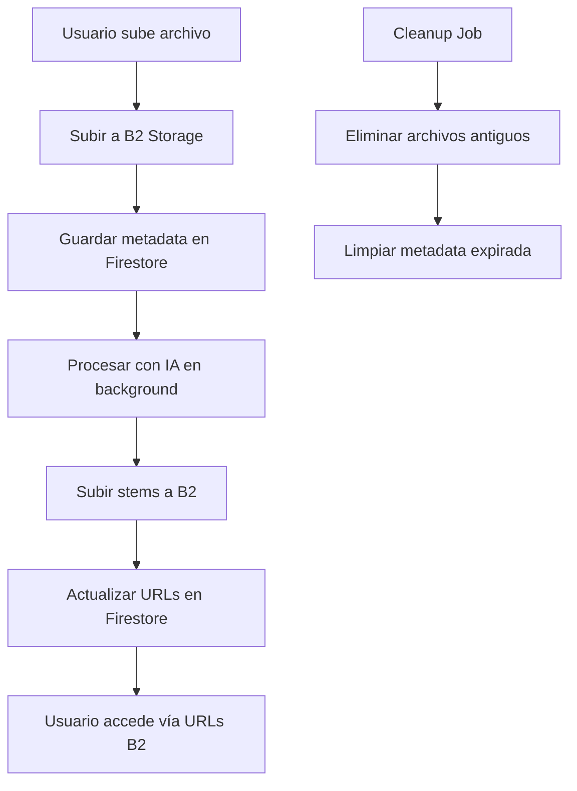

# 🎵 Moises Style Architecture

## 🚀 Arquitectura Simplificada Estilo Moises

Esta implementación replica la arquitectura de Moises con las siguientes mejoras:

### ✨ Características Principales

- **☁️ Solo B2 Storage**: Todos los archivos se almacenan en la nube
- **🔄 URLs Consistentes**: Acceso directo desde cualquier dispositivo  
- **🗑️ Sin Archivos Locales**: No ocupa espacio en el servidor
- **🧹 Limpieza Automática**: Archivos temporales se eliminan automáticamente
- **📊 Metadata en Firestore**: Información persistente en base de datos
- **⚡ Procesamiento Optimizado**: Flujo simplificado y eficiente

## 🏗️ Arquitectura del Sistema



## 🛠️ Servidores

### 1. **Frontend Next.js** - Puerto 3000
```bash
npm run dev
```
- Interfaz de usuario React/Next.js
- Componente `MoisesStyleUpload`
- Página `/moises-style`

### 2. **Proxy B2** - Puerto 3001
```bash
.\start-proxy.bat
```
- Proxy para Backblaze B2 storage
- Manejo de subida de archivos
- Caché temporal

### 3. **Backend Original** - Puerto 8000
```bash
cd backend && python main.py
```
- API original con almacenamiento híbrido
- Compatibilidad con código existente

### 4. **Moises Style API** - Puerto 8001 ⭐
```bash
cd backend && python moises_main.py
```
- **Nueva API simplificada**
- Solo B2 Storage
- Limpieza automática integrada

## 🚀 Inicio Rápido

### Opción 1: Script Automático
```bash
.\start-moises-style.bat
```

### Opción 2: Manual
```bash
# Terminal 1: Frontend
npm run dev

# Terminal 2: Proxy B2
.\start-proxy.bat

# Terminal 3: Backend Original
cd backend && python main.py

# Terminal 4: Moises Style API
cd backend && python moises_main.py
```

## 🎵 Uso de la Aplicación

1. **Acceder a la aplicación**:
   - Frontend: http://localhost:3000
   - Moises Style: http://localhost:3000/moises-style

2. **Subir archivo de audio**:
   - Seleccionar archivo (MP3, WAV, etc.)
   - Elegir opciones de separación
   - Activar modo Hi-Fi si se desea
   - Hacer clic en "Separar Audio Estilo Moises"

3. **Resultados**:
   - Archivo original subido a B2
   - Stems separados disponibles en B2
   - Metadata guardada en Firestore
   - URLs directas para reproducción

## 📁 Estructura de Archivos B2

```
moises/
├── originals/
│   └── {user_id}/
│       └── {song_id}/
│           └── original.{ext}
└── stems/
    └── {user_id}/
        └── {song_id}/
            ├── vocals.wav
            ├── instrumental.wav
            ├── drums.wav
            ├── bass.wav
            └── other.wav
```

## 🔧 API Endpoints

### Moises Style API (Puerto 8001)

#### Separar Audio
```http
POST /api/separate
Content-Type: multipart/form-data

file: [archivo de audio]
separation_type: "vocals-instrumental" | "vocals-drums-bass-other"
hi_fi: true | false
user_id: "usuario123"
```

#### Subir Solo Original
```http
POST /api/upload-original
Content-Type: multipart/form-data

file: [archivo de audio]
user_id: "usuario123"
song_id: "song123"
```

#### Obtener Archivos del Usuario
```http
GET /api/user-files/{user_id}
```

#### Limpieza Manual
```http
POST /api/cleanup/manual
```

#### Estadísticas de Limpieza
```http
GET /api/cleanup/stats
```

#### Limpiar Usuario Específico
```http
POST /api/cleanup/{user_id}?days_old=7
```

## 🧹 Sistema de Limpieza

### Automático
- **Intervalo**: Cada 1 hora
- **Archivos temporales**: Eliminados después de 1 hora
- **Directorios temporales**: Eliminados después de 2 horas
- **Logs**: Eliminados después de 7 días

### Manual
```bash
# Limpieza completa
curl -X POST http://localhost:8001/api/cleanup/manual

# Limpieza específica de usuario
curl -X POST http://localhost:8001/api/cleanup/usuario123?days_old=7

# Ver estadísticas
curl http://localhost:8001/api/cleanup/stats
```

## 📊 Monitoreo

### Verificar Estado de Servidores
```bash
# Frontend
curl http://localhost:3000

# Proxy B2
curl http://localhost:3001/api/health

# Backend Original
curl http://localhost:8000/api/health

# Moises Style API
curl http://localhost:8001/api/health
```

### Estadísticas del Sistema
```bash
curl http://localhost:8001/api/stats
```

## 🔍 Diferencias con la Arquitectura Original

| Aspecto | Arquitectura Original | Moises Style |
|---------|----------------------|--------------|
| **Almacenamiento** | Local + B2 + Firestore | Solo B2 + Firestore |
| **URLs** | Mixtas (localhost + B2) | Solo B2 |
| **Limpieza** | Manual | Automática |
| **Persistencia** | Compleja | Simplificada |
| **Escalabilidad** | Limitada | Alta |
| **Mantenimiento** | Alto | Bajo |

## 🎯 Ventajas de Moises Style

1. **🚀 Rendimiento**: Sin I/O local, todo en la nube
2. **📱 Acceso Universal**: URLs funcionan desde cualquier dispositivo
3. **🔄 Escalabilidad**: Fácil escalado horizontal
4. **🧹 Mantenimiento**: Limpieza automática, menos gestión manual
5. **💾 Eficiencia**: No duplicación de archivos
6. **🔒 Seguridad**: Archivos en B2 con URLs temporales
7. **📊 Monitoreo**: Estadísticas y logs centralizados

## 🐛 Solución de Problemas

### Servidor no inicia
```bash
# Verificar dependencias
pip install -r requirements.txt
npm install

# Verificar puertos
netstat -an | findstr :3000
netstat -an | findstr :3001
netstat -an | findstr :8000
netstat -an | findstr :8001
```

### Error de B2
```bash
# Verificar configuración B2
curl http://localhost:8001/api/health
```

### Error de Firestore
```bash
# Verificar configuración Firebase
# Revisar archivo .env.local
```

## 📝 Logs

Los logs se guardan en:
- **Frontend**: Consola del navegador
- **Backend**: Terminal donde se ejecuta
- **Cleanup**: Terminal + archivos de log (si están configurados)

## 🤝 Contribución

Para contribuir a esta arquitectura:

1. Modificar `backend/moises_style_processor.py`
2. Actualizar `backend/moises_main.py`
3. Modificar `components/MoisesStyleUpload.tsx`
4. Probar en `app/moises-style/page.tsx`

## 📞 Soporte

Si tienes problemas:

1. Verificar que todos los servidores estén corriendo
2. Revisar logs en las terminales
3. Comprobar conectividad B2
4. Verificar configuración Firebase

---

**🎵 ¡Disfruta de la nueva arquitectura Moises Style!**
